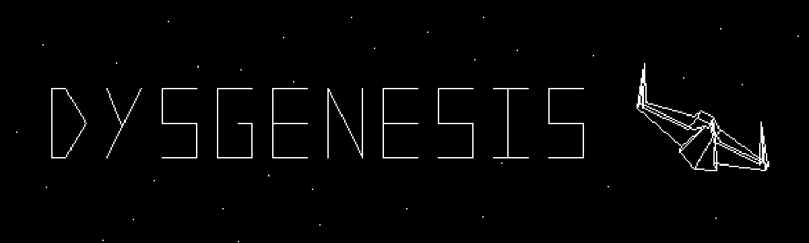
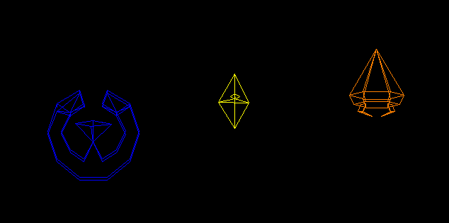
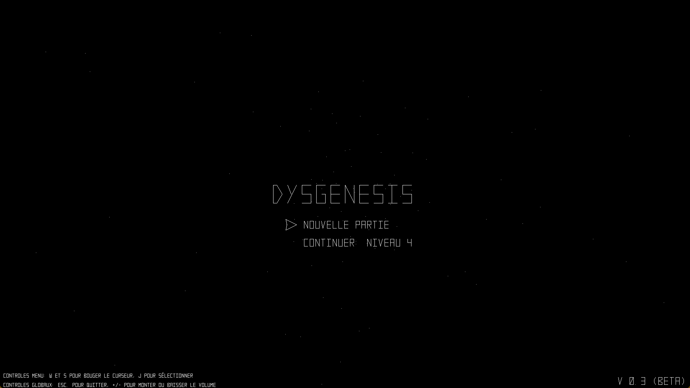
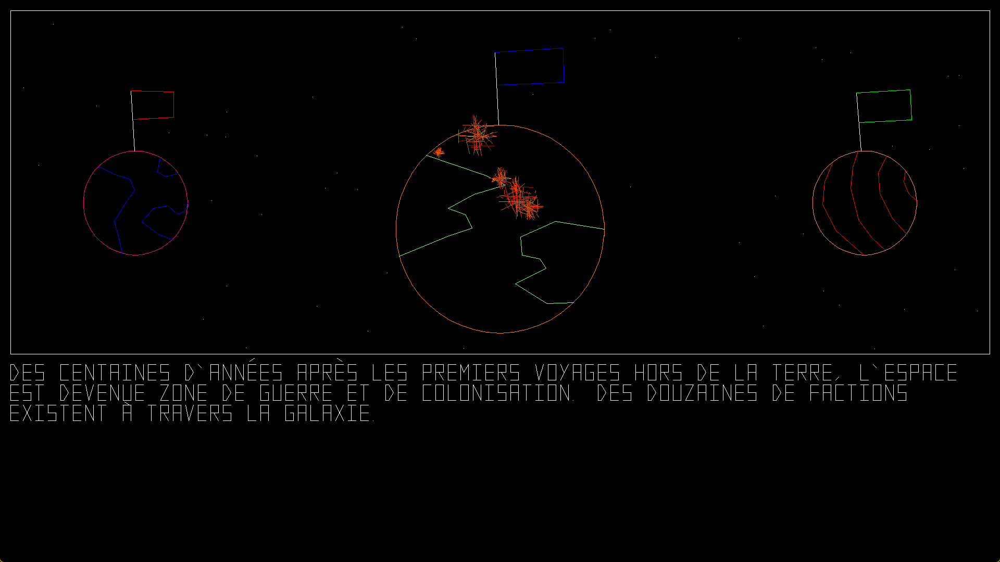
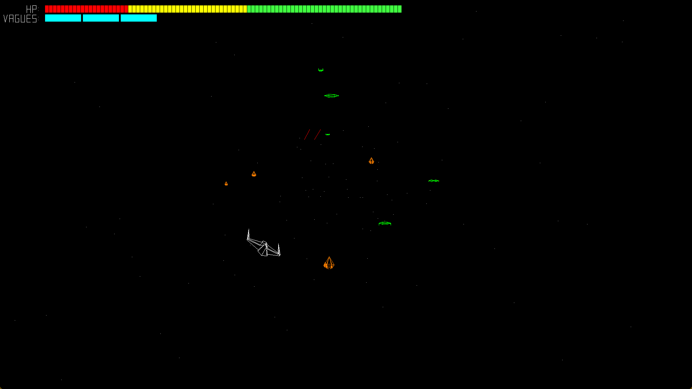
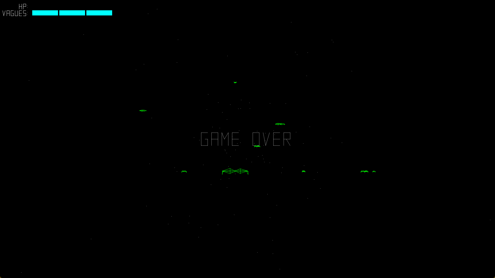
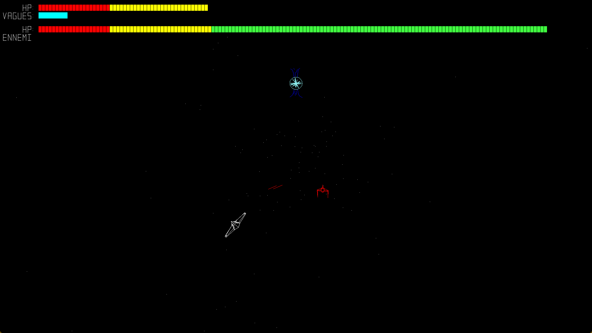

# **Dysgenesis**

Dysgenesis est le premier jeu complet que j'ai jamais fait, mais depuis que je l'ai complété, j'ai continué à l'améliorer pour qu'il soit plus lisible, plus maintenable et plus rapide.

Ce jeu est fait dans SDL, et ne contient aucune texture ou image. Tout est dessiné avec l'outil pour dessiner des lignes, et les modèles ont étés fait à la main.

## Histoire du Jeu

Des centaines d'années dans le futur, la galaxie est plongée dans une longue, longue guerre. Des faction de chaque coin de la voie lactée son en combat contre tous les autres pour des ressources et le contrôle. Tu es l'un des meilleures pilotes de ta faction. Après des années de combat, tu décide de prendre une pause pour quelques mois. Mais un jour, une lettre arrive à la porte, et elle vient directement du gouvernement. Tu as été choisi pour mener une mission secrète qui fera la différence entre la destruction de ta faction et une grande victoire importante. Des espions ont trouvé que la faction voisine est en traind e construire une bombe à pulsar qui contient assez d'énergie pour détruire un cinquième de la galaxie. Tu devras aller piloter ton nouveau vaisseau puissant dans la faction ennemie pour détruire les gardes de leur bombe, ce qui permettera à ton équipe d'y prendre possesion. Vas-tu trouver la gloire pour ton héroisme? Ou vas-tu cherche à mettre une fin à cette guerre?

## Techniques Utilisées

Ce jeu n'utilise que les outils de débogguage de SDL pour dessiner des lignes, des points, et des rectangles. Cela veut dire que l'apparence 3D a dû être fait manuellement. Cela veut dire que je devais trouver une facon de dessiner une liste de points en x,y,z sur l'écran sans avoir à faire tout les maths que les engins 3D font.

La technique que j'ai d'utiliser est de "tricher" le 3D. Premièrement, la caméra est fixe. Deuxièmement, pour les 3 axes de rotation, seulement 1,5 fonctionnent. Les modèles sont capables de tourner en roll, car c'était une rotation simple. Et peuvent modifier leur pitch, mais pas trop. J'ai utilisé l'approximation sin(x) ~ x pour simplifier les petits mouvements de haut et bas que les modèles ferront.

Les autres techniques pour l'apparence 3D sont partout dans le jeu. Les objets deviennent plus petits le plus loin ils sont du joueur, ce qui fabrique le sens de perspective. Au début, j'avais l'idée que le plus loin que quelquechose était, le plus qu'il se raprocherait du centre de l'écran, mais non seulement cela avait l'air bizarre, mais c'était dificile de jouer. Alors j'ai enlevé cette technique.

Les modèles 3D des objets dans ce jeux sont deux listes. La première liste est une liste de points 3D, et la deuxième liste est une liste d'indexs dans la première liste. Le jeu dessine les objets en calculant la position de chaque point 3D, et dessine une ligne de l'un à l'autre. Mais, si l'index du point se trouve dans la deuxième liste, la ligne n'est pas dessinée. Cela permet de facilement contenir un modèle pour un style "wireframe".

De plus, les modèles des ennemis bougent. Ils peuvent tourner sur place, tourner une partie de leur corps ou avoir des enfants autour d'eux. Ceci est fait en modifiant le modèle 3D des ennemis en temps réél, en sachant exactememnt quels points à changer dans leur modèles, et les modifiant avec de nouvelles valeures.

## Comment Jouer

Ce jeu est fait pour être joué en 1920 x 1080, mais c'est aussi possible de jouer à des résolution un peu plus grandes. Tu peux aussi jouer avec un écran plus petits, mais les scènes animés ne fonctionneront pas, donc ils seront automatiquement enlevés.

Les contrôles globaux fonctionnent n'importe où dans le jeu et sont écrits au menu du jeu:

- +/- pour ajuster le volume
- échapp. pour quitter.

Le texte du jeu est tout écrit en français, mais je vais peut-être ajouter une option pour anglais bientôt.

Le jeu peut être téléchargé dans la section "Releases" de la page GitHub.

## Images du Jeu

